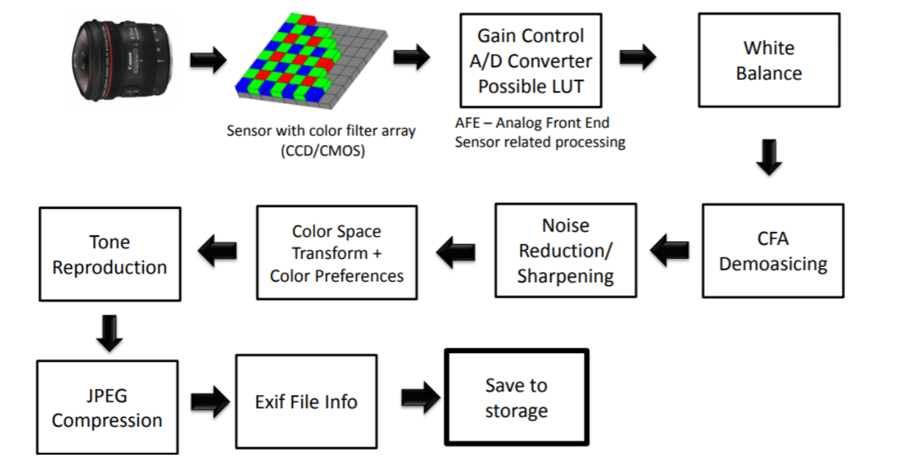
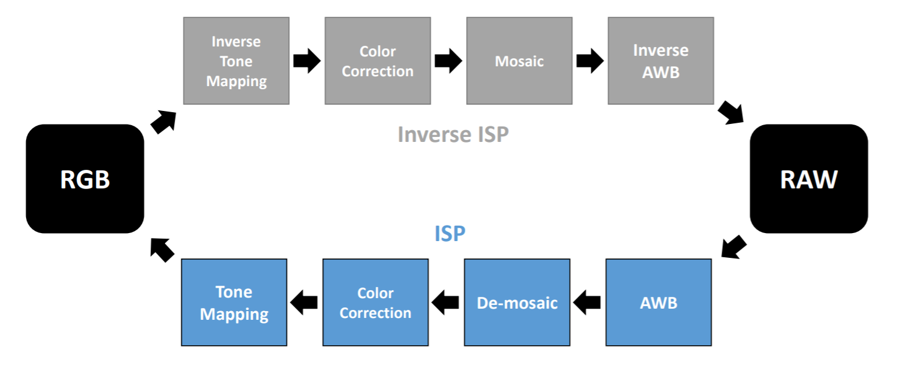

# Image Sensing Pipeline

# In this homework ……

# Homework 1_2 說明

## 1. 請安裝 packgage colour-demosaicing 
> ## `pip install colour-demosaicing`

## 2. 檔案不包含圖片
## 3. 檔案不包含 `tone_curves.mat` , `tone_curves_inv.mat`
## 4. 檔案只有.py 檔, 名稱未修改. 有修改過的.py檔如下:
> ### (1) `color_correction.py`
> ### (2) `demosaic_and_mosaic.py`
> ### (3) `white_balance.py`
> ### (4) `hw1_2.py`
(將hw1_2.py的第51行 ccm = ccm / np.tile(np.sum(ccm, axis=1), [3, 1]).T
改為ccm = (ccm / np.tile(np.sum(ccm, axis=1), [3, 1]).T).T
